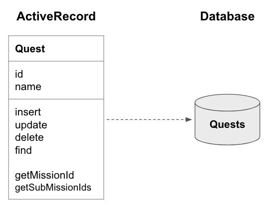
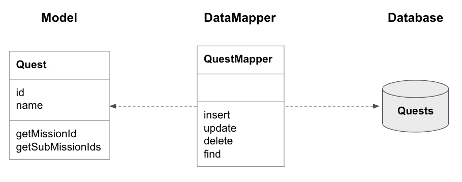

# 素人がORMについて調査してみた
## 概要
データベースを触るうえで欠かせないORMという概念に触れることになった。しかし、今までデータベースを触ったことがほとんどなく、生成AIに頼りながらdocker上で動かすためにPrisma ORM+PostgreSQL+Next.jsで行ったがよくエラーに阻まれていた。そのため、AIに投げていてとても時間がかかってしまったことから、今回の機会を通して今回使用したPrisma ORMの最低限の手順と基本的な知識を学びたいと思う。
## ORMとは？
ORMとはオブジェクトリレーショナルマッピングの略称でプログラミング言語のエンティティ[^1]とそれに対応するデータベース要素との関係を抽象化するプロセス。名前の通りオブジェクト[^2]とリレーショナルデータベース[^3]の橋渡しをする仕組みである。
## ORMの種類
- Active Record<br>
データベースの各テーブルをモデルとして扱うORM。CRUDメソッド[^4]を用意していて、オブジェクトを生成しやすくなる。メインプログラムに直接書き込むタイプ。<br>

- Data Mappeer<br>
テーブル操作の機能を集めたData Mapperが存在し、モデルとテーブルの仲介役となる。メインとは別のプログラムに記述し間接的に利用するタイプ。<br>

簡単に要約するとDBを自分の能力で翻訳して記憶し、記憶から必要な情報にアクセスするActive Recordタイプと翻訳機(DataMapper)を仲介させて翻訳したデータから必要な情報にアクセスするData Mappeerタイプがあるよということなのだろうか。
## Prisma ORMについて
概要で述べた本題のORMである。Prisma ORM v7系へののアップデート伴い、一部の書き方が変わったため記事も少なく非常に導入に苦労した。これからメモ程度に導入方法を残していきたい。やり方としては大まかに以下の手順で導入する。
1. Prisma ORM および関連パッケージのインストール<br>
まず最新のPrizma ORMとPostgreSQLドライバをインストールする<br>
`pnpm add prisma @prisma/client pg`<br>
Prismaの初期設定を行う<br>
`pnpm prisma init`<br>
実行後、モデルを定義するためのファイルであるprisma/schema.prismaが生成される

2. Prisma の初期設定と PostgreSQL との接続設定<br>
`.env `ファイルにデータベース接続情報を記述した。<br>
Prisma v7では`prisma.config.ts`を利用するため、設定ファイルも作成する。<br>
ここのdatasourceの書き方がバージョンによって違うため注意が必要
```typescript
import "dotenv/config"
import { defineConfig } from "prisma/config";
export default defineConfig({
  schema: "prisma/schema.prisma",
  migrations: {
    path: "prisma/migrations",
  },
  datasource: {
    url: process.env.DATABASE_URL,
  },
});

```


3. schema.prisma の作成およびデータモデルの定義<br>
どのような型でどのような情報を保存したいかというスキーマ（設計図）の作成
```
model [変数名]{
    id Int @id @default(autoincrement())
    name String
}
```
4. マイグレーションの実行によるテーブル作成<br>
データベースへテーブルを作成する<br>
`pnpm prisma migrate dev --name [ファイル名]`<br>
マイグレーションファイル[^5]は`prisma/migrations`に生成される<br>
このファイルはデータログであり、万が一何か変更したデータベースが問題だった場合にすぐに戻すことが出来るものである。<br>
5. Prisma Client の生成<br>
スキーマから情報の受け皿（Prisma Client）を作成する<br>
`pnpm prisma generate`<br>
このコマンドによって生成されたクライアントを利用してデータベースへアクセスする<br>
なおコマンド実行時のスキーマが適応されるため、スキーマ変更時には手順4からコマンドをやり直す必要がある<br>
6. Prisma Client 共通ファイルの作成<br>
アプリケーション全体でPrisma Clientを共有するためlib/prisma.tsを作成する<br>
このファイルを経由することで手順5で生成したPrisma Clientを使用するために複数回生成しなおす手間がなくなる。<br>
```
import { PrismaClient } from "../../generated/prisma"; 
const prisma = new PrismaClient(); 
export default prisma;
```
7. Prisma Client を利用した CRUD 処理の実装<br>
8. Prisma Client を利用した CRUD 処理を用いてデータをデータベースに挿入<br>
9. 動作確認およびデバッグ<br>
データベースに保存されているデータの確認<br>
`pnpm prisma studio`


## おまけ1：一括で古いデータベースを削除し新しくデータベースを作成するときに役立ちそうなもの<br>
今回データの削除と生成をプログラム実行時に行いたかったがIDの履歴が消えなかったため以下の方法でIDごと中身を初期化することが出来た
```
  await prisma.$executeRawUnsafe(`
        TRUNCATE TABLE [名前]
        RESTART IDENTITY CASCADE;
    `);
```

## おまけ2：DATABASE_URLがうまく読み込まれなかったための対応
今回うまくenvファイルが読み込まれなかったため以下の

## 脚注
[^1]: データやプログラム上で「一意に識別できる独立した実体・対象物」
[^2]: プログラム内のクラスやインスタンス
[^3]: SQLの世界
[^4]: データベースやストレージにおいて、データを管理するために必要な4つの基本機能（Create、Read、Update、Delete）の頭文字をとった言葉
[^5]: スキーマ（設計図）をもとにどのようにデータベースを作成・変更するのかを記した手順書のようなもの
## 参考資料
1. Qiita「ORMフレームワークについて」url:https://qiita.com/takuma16/items/485d7e492013281a16e5
2. note「SQL勉強会-ORMと仲良くなろう」url:https://note.com/creava/n/n34a0c1d0ff45
3. AWS「オブジェクトリレーショナルマッピング (ORM) とは」url:https://aws.amazon.com/jp/what-is/object-relational-mapping/
4. Hatena Blog「DataMapperを利用した場合におけるN+1問題の解決と処理の分離」url:https://blog.colopl.dev/entry/2022/08/31/110152
5. Prisma公式サイト url:https://www.prisma.io/docs/guides/frameworks/nextjs?utm_source=chatgpt.com
6. Qiita 「Prisma v7 のアップグレードガイド通りに進めて詰まった方へ」 url:https://qiita.com/benjuwan/items/330397bbb550af5c515f
7. Stack OverFlow「Prisma V7 Error: Client Password must be a string」url:https://qiita.com/benjuwan/items/330397bbb550af5c515f
8. Zenn「Prismaで快適にテストを行なうヘルパーを考えた」 url:https://zenn.dev/susiyaki/articles/36a11cddd38e3a
9. Zenn「Prisma Schemaの書き方あれこれ」 url:https://zenn.dev/ikekyo/scraps/f6c87fbfd3bf9d
